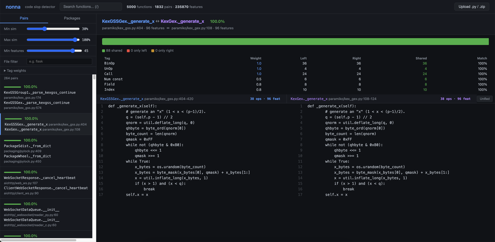

# 👵🏻

> Nonnas against slop.

**[Live demo](https://thebabush.github.io/nonna)**

**nonna** is a **code slop detector**. It finds copy-pasted, reheated Python functions hiding under different variable names, the kind of thing a nonna would spot immediately because she is just like that: amazing.

Good code is like nonna's cooking: made with intention, distinct, recognisable 🍝. **Slop is slop.** She can tell.

## Screenshot

100% match between `KexGSSGex._generate_x` and `KexGex._generate_x` in paramiko. Identical crypto key generation logic, two different class names.

## What it does

nonna finds **structurally similar functions** across your codebase even when variable names, comments, and formatting differ. It extracts a data-flow graph from each function, computes IDF-weighted structural feature hashes, and scores pairs by similarity. **Rename-invariant**, noise-resistant. Powered by **Rust** and **tree-sitter**.

**Languages supported:**
- Python
- more coming

## Your code stays on your machine

nonna runs entirely in your browser via **WebAssembly**. Nothing is uploaded anywhere. Your code never leaves your machine.

## Try it

Upload a `.py` file or a `.zip` of your project using the button in the top-right corner. nonna scores your functions against a pre-indexed corpus of **5,000 functions** from popular Python packages and shows matches instantly.

## Disclaimer

Vibecoded with love.
